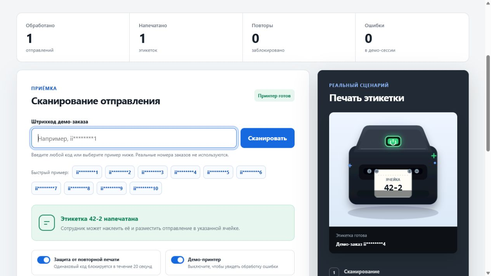

# ПВЗ Ячейки - интерактивное демо

Безопасная демонстрационная версия операционного продукта для пунктов выдачи заказов. Демо показывает основной пользовательский сценарий: сотрудник сканирует отправление, система распознаёт назначенную ячейку и отправляет этикетку на печать.

Мультяшная анимация принтера полностью нарисована с помощью SVG и CSS по мотивам реального рабочего сценария. Исходные фотографии и видео в проекте не используются и не публикуются.



## Зачем создан продукт

При ручной записи номера ячейки сотрудники допускали ошибки при размещении заказов. Это увеличивало время последующего поиска и создавало дополнительную нагрузку в часы пик.

По результатам пилота:

- количество ошибок размещения снизилось с 16 до 2 в неделю;
- снижение составило 87,5%;
- среднее время приёмки сохранилось на уровне около 39 минут на 100 отправлений.

Подробнее о продуктовом исследовании и методике измерения: [кейс в портфолио](https://github.com/Jonson2772/product-manager-portfolio/blob/main/cases/pickup-point-operations.md).

## Что можно попробовать

1. Ввести любой синтетический код, например `ii********1`.
2. Запустить сканирование и увидеть распознанную ячейку.
3. Повторить тот же код и проверить защиту от повторной печати.
4. Выключить демо-принтер и посмотреть обработку ошибки.
5. Очистить сессию и начать заново.

## Запуск

Проект не требует сборки или установки зависимостей.

Откройте `index.html` в браузере либо запустите локальный сервер:

```powershell
python -m http.server 8080
```

После этого откройте `http://localhost:8080`.

## Состав проекта

```text
index.html   интерфейс демо
styles.css  адаптивные стили и состояния
app.js      сценарий сканирования, печати и защиты от повторов
assets/     скриншот интерфейса для README
```

## Чем демо отличается от рабочего продукта

Публичная версия намеренно не содержит:

- интеграцию с интерфейсом конкретного маркетплейса;
- браузерное расширение и production-селекторы;
- подключение к Windows spooler и физическому принтеру;
- лицензирование, backend, платежи и deployment-конфигурацию;
- реальные номера заказов, адреса ПВЗ и данные сотрудников;
- production-домены, токены, ключи и журналы работы.

Коды ячеек и отправлений в демо создаются локально из синтетических данных. Информация не отправляется на сервер и исчезает после обновления страницы.

## Production-архитектура

Рабочий продукт состоит из браузерного расширения, локального Windows-агента печати, desktop-интерфейса и облачного контура лицензирования. Эта архитектура описана на уровне продукта, но её инфраструктурная реализация не публикуется из соображений безопасности.

## Автор

Денис Проскуряков - Product Manager.

- [Продуктовое портфолио](https://github.com/Jonson2772/product-manager-portfolio)
- [GitHub-профиль](https://github.com/Jonson2772)
- [Telegram](https://t.me/DenRoks)

## Дисклеймер

Это независимая демонстрационная версия. Она не является продуктом или официальным инструментом какого-либо маркетплейса и не подключается к его системам.
